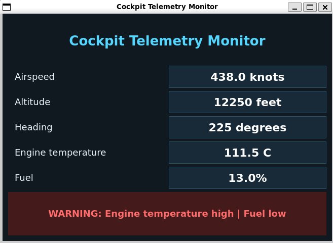

# Cockpit Telemetry Monitor

A real-time aircraft telemetry simulator and cockpit-style desktop
dashboard built with C++17, Qt 6, and CMake.

The application generates changing flight data, evaluates warning
conditions, and displays live measurements through both console and
Qt-based interfaces.



## Features

- Simulates airspeed, altitude, heading, engine temperature, and fuel
- Updates the Qt dashboard every 500 milliseconds
- Detects high engine temperature and low fuel conditions
- Displays normal and warning states using visual color changes
- Separates telemetry logic from console and graphical interfaces
- Includes automated warning tests through CTest
- Builds and runs on Ubuntu through WSL 2

## Architecture

```text
TelemetrySimulator
        |
        v
TelemetryReading
        |
        v
evaluateWarnings()
        |
        v
WarningStatus
        |
        +----> Console monitor
        |
        +----> Qt dashboard